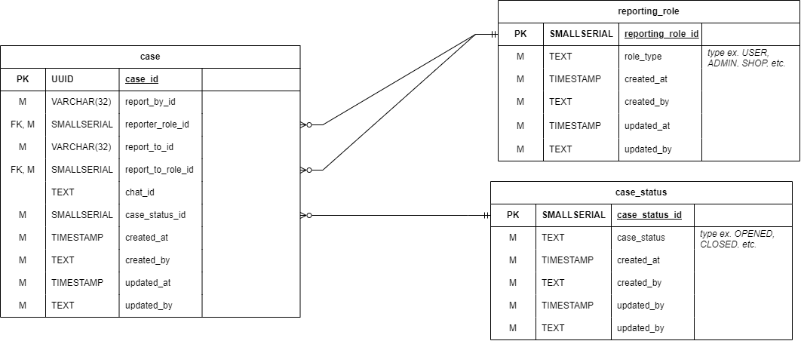
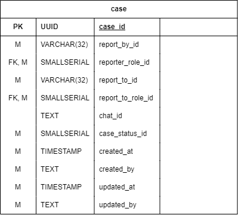
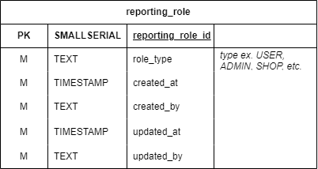
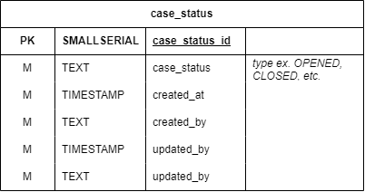

# Case service

### Overview

<figure><figcaption>
ฐานข้อมูลเรื่องรายงาน/การติดต่อผู้ดูแล
</figcaption></figure>

ฐานข้อมูล Case เป็นฐานข้อมูลที่เก็บข้อมูลที่เกี่ยวข้องกับการรายงาน/การติดต่อผู้ดูแล อยู่ภายใต้ Case service โดยหลักๆจะใช้กับการจัดการเรื่องรายงาน/การติดต่อของ[ผู้ใช้ทั่วไป](../../../overview/target-groups.md)หรือ[ร้านค้า](../../../overview/target-groups.md)

### ตารางภายในฐานข้อมูล

#### case

<figure><figcaption>
ตาราง case
</figcaption></figure>

ตาราง case ใช้เก็บข้อมูลที่เกี่ยวข้องกับการรายงาน/การติดต่อต่างๆ (ไม่ได้เก็บการแชท)

##### รายละเอียดของฟิลด์

| ชื่อฟิลด์ | ประเภทข้อมูล | คำอธิบาย |
| :--- | :--- | :--- |
| case_id | UUID | รหัสของการติดต่อ |
| report_by | VARCHAR(32) | [รหัสของผู้ใช้](../user/user-service.md#user) หรือ[รหัสของร้านค้า](../shop-and-transaction/shop-service.md)หรือ[ผู้ดูแล](../user/admin-service.md#admin)ที่รายงาน/ติดต่อ |
| report_role_id | SMALLSERIAL | [รหัสของบทบาทของผู้รายงาน/ติดต่อ](#report_role) |
| report_to | VARCHAR(32) | [รหัสของผู้ใช้](../user/user-service.md#user) หรือ[รหัสของร้านค้า](../shop-and-transaction/shop-service.md) ที่ถูกรายงาน/ติดต่อ |
| report_to_role_id | SMALLSERIAL | [รหัสของบทบาทของผู้ถูกรายงาน/ติดต่อ](#report_role) |
| chat_id | TEXT | รหัสของการแชทที่เกี่ยวข้องกับการรายงาน/การติดต่อ |
| case_status_id | SMALLSERIAL | [รหัสของสถานะของการรายงาน/การติดต่อ](#case_status) |

#### report_role

<figure><figcaption>
ตาราง report_role
</figcaption></figure>

ตาราง report_role ใช้เก็บข้อมูลบบทบาทของผู้รายงาน/ติดต่อและผู้ถูกรายงาน/ติดต่อ

##### รายละเอียดของฟิลด์

| ชื่อฟิลด์ | ประเภทข้อมูล | คำอธิบาย |
| :--- | :--- | :--- |
| report_role_id | SMALLSERIAL | รหัสของบทบาทของผู้รายงาน/ติดต่อ |
| role_type | TEXT | ประเภทของผู้รายงาน/ติดต่อและผู้ถูกรายงาน/ติดต่อ เช่น ร้านค้า, ผู้ใช้, ผู้ดูแล |

#### case_status

<figure><figcaption>
ตาราง case_status
</figcaption></figure>

ตาราง case_status ใช้เก็บข้อมูลสถานะของการรายงาน/การติดต่อ

##### รายละเอียดของฟิลด์

| ชื่อฟิลด์ | ประเภทข้อมูล | คำอธิบาย |
| :--- | :--- | :--- |
| case_status_id | SMALLSERIAL | รหัสของสถานะของการรายงาน/การติดต่อ |
| case_status | TEXT | ชื่อของสถานะของการรายงาน/การติดต่อ เช่น เปิด, ปิด |