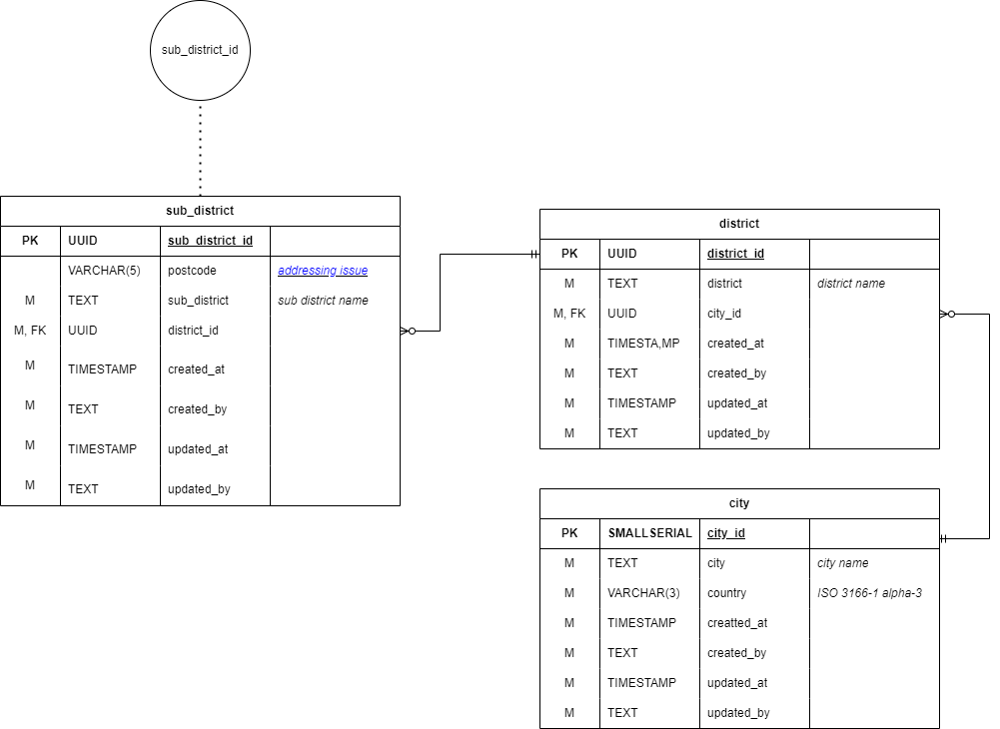
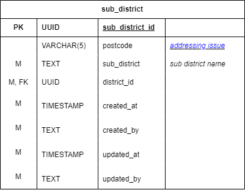
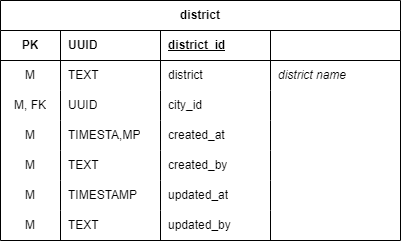
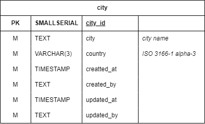

# District service

### Overview

<figure><figcaption>
ฐานข้อมูลที่อยู่ตำบล
</figcaption></figure>

ฐานข้อมูล District เป็นฐานข้อมูลที่เก็บข้อมูลที่เกี่ยวข้องกับตำบล อยู่ภายใต้ District service โดยหลักๆจะใช้กับที่อยู่จัดส่ง และที่อยู่ของร้านค้า โดยจะเก็บข้อมูลที่เกี่ยวข้องกับตำบล อำเภอ จังหวัด และ รหัสไปรษณีย์

### ตารางภายในฐานข้อมูล

#### sub\_district
<figure><figcaption>
ตาราง sub_district
</figcaption></figure>

ตาราง sub\_district ใช้เก็บข้อมูลที่เกี่ยวข้องกับตำบล ซึ่งบริการอื่นจะเรียกใช้จากส่วนนี้

##### รายละเอียดของฟิลด์

| ชื่อฟิลด์ | ประเภทข้อมูล | คำอธิบาย |
| :---- | :--- | :--- |
| sub_district_id | UUID | รหัสของตำบล |
| postcode| VARCHAR(5) | รหัสไปรษณีย์ตาม [Addressing Issue ของ Universal Postal Union](https://www.upu.int/UPU/media/upu/documents/PostCode/General-Addressing-Issues.pdf) |
| sub_dustrict | TEXT | ชื่อของตำบล |
| district_id | UUID | [รหัสของอำเภอ](#district) |

#### district
<figure><figcaption>
ตาราง district
</figcaption></figure>

ตาราง district ใช้เก็บข้อมูลที่เกี่ยวข้องกับอำเภอ

##### รายละเอียดของฟิลด์

| ชื่อฟิลด์ | ประเภทข้อมูล | คำอธิบาย |
| :--- | :--- | :--- |
| district_id | UUID | รหัสของอำเภอ |
| district | TEXT | ชื่อของอำเภอ |
| city_id | UUID | [รหัสของเมือง](#city) |

#### city

<figure><figcaption>
ตาราง city
</figcaption></figure>

ตาราง city ใช้เก็บข้อมูลที่เกี่ยวข้องกับจังหวัด

##### รายละเอียดของฟิลด์

| ชื่อฟิลด์ | ประเภทข้อมูล | คำอธิบาย |
| :--- | :--- | :--- |
| city_id | UUID | รหัสของจังหวัด |
| city | TEXT | ชื่อของจังหวัด |
| country | VARCHAR(3) | รหัสประเทศคาม[มาตรฐาน ISO 3166-1 alpha-3](https://en.wikipedia.org/wiki/ISO_3166-1_alpha-3) |
