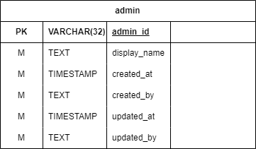

# Admin service

### Overview

<figure><figcaption>
ฐานข้อมูลใน admin service
</figcaption></figure>

ฐานข้อมูล Admin เป็นฐานข้อมูลที่เก็บข้อมูลที่เกี่ยวข้องกับ[ผู้ดูแลระบบ](../../ux-ui/user-interface/admin.md) อยู่ภายใต้ Admin service โดยหลักๆจะใช้กับการจัดการผู้ใช้ และการจัดการร้านค้า

### ตารางภายในฐานข้อมูล

#### admin

<figure><figcaption>
ตาราง admin
</figcaption></figure>

ตาราง admin ใช้เก็บข้อมูลที่เกี่ยวข้องกับผู้ดูแลระบบ

##### รายละเอียดของฟิลด์

| ชื่อฟิลด์ | ประเภทข้อมูล | คำอธิบาย |
| :--- | :--- | :--- |
| admin_id | UUID | รหัสของผู้ดูแลระบบ |
| display_name | TEXT | ชื่อที่ใช้แสดง |