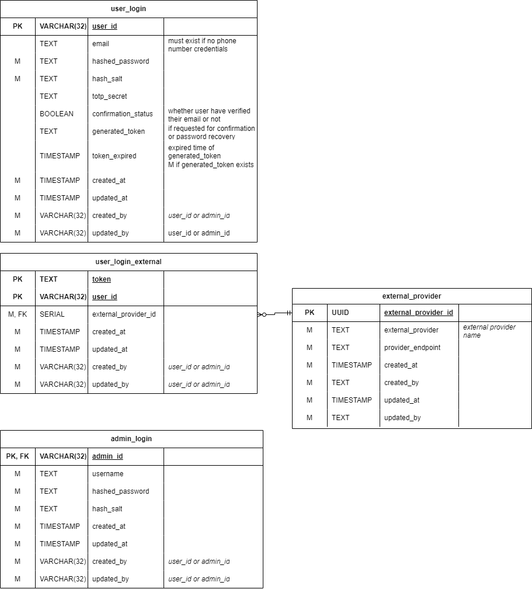

# Authentication service

### Overview

<figure><figcaption>
ฐานข้อมูลใน authentication service
</figcaption></figure>

ฐานข้อมูล Authentication เป็นฐานข้อมูลที่เก็บข้อมูลที่เกี่ยวข้องกับการยืนยันตัวตนของ[ผู้ใช้ทั่วไป](../../../overview/target-groups.md)และ[ผู้ดูแล](../../ux-ui/user-interface/admin.md) อยู่ภายใต้ Authentication service โดยหลักๆจะใช้กับการจัดการการยืนยันตัวตนของผู้ใช้ และการจัดการสิทธิ์การเข้าถึงข้อมูล

### ตารางภายในฐานข้อมูล

#### user\_login

<figure><figcaption>
ตาราง user_login
</figcaption></figure>

ตาราง user_login ใช้เก็บข้อมูลที่เกี่ยวข้องกับการเข้าสู่ระบบของผู้ใช้

##### รายละเอียดของฟิลด์

| ชื่อฟิลด์ | ประเภทข้อมูล | คำอธิบาย |
| :--- | :--- | :--- |
| user_id | VARCHAR(32) | [รหัสของผู้ใช้](./user-service.md#user) |
| email | TEXT | อีเมลของผู้ใช้ จำเป็นต้องมีหากไม่ได้ให้หมายเลขโทรศัพท์ |
| hashed_password | TEXT | รหัสผ่านที่ถูกเข้ารหัส |
| hashed_salt | TEXT | ค่า salt ของรหัสผ่าน |
| totp_secret | TEXT | ค่า secret ของ TOTP สำหรับการยืนยันตัวตนสองขั้นตอน |
| confirmation_status | BOOLEAN | สถานะการยืนยันตัวตนของผู้ใช้ |
| generated_token | TEXT | โทเคนที่ถูกสร้างขึ้นสำหรับการยืนยันตัวตนของผู้ใช้ ในกรณีที่ยืนยันตัว หรือ ลืมรหัสผ่าน |
| token_expired | TIMESTAMP | วันเวลาที่โทเคนหมดอายุ |

#### user\_login\_external

<figure><figcaption>
ตาราง user_login_external
</figcaption></figure>

ตาราง user_login_external ใช้เก็บข้อมูลที่เกี่ยวข้องกับการเข้าสู่ระบบของผู้ใช้ผ่านช่องทางอื่นๆ เช่น โซเชียลมีเดีย

##### รายละเอียดของฟิลด์

| ชื่อฟิลด์ | ประเภทข้อมูล | คำอธิบาย |
| :--- | :--- | :--- |
| user_id | VARCHAR(32) | [รหัสของผู้ใช้](./user-service.md#user) |
| token | TEXT | รหัสของผู้ใช้ในระบบของผู้ให้บริการ |
| external_provider_id | SMALLSERIAL | [รหัสของผู้ให้บริการ](#external_provider) |

#### external\_provider

<figure><figcaption>
ตาราง external_provider
</figcaption></figure>

ตาราง external_provider ใช้เก็บข้อมูลที่เกี่ยวข้องกับผู้ให้บริการที่ใช้ในการยืนยันตัวตนผู้ใช้ผ่านช่องทางอื่นๆ

##### รายละเอียดของฟิลด์

| ชื่อฟิลด์ | ประเภทข้อมูล | คำอธิบาย |
| :--- | :--- | :--- |
| external_provider_id | SMALLSERIAL | รหัสของผู้ให้บริการ |
| external_provider_name | TEXT | ชื่อของผู้ให้บริการ |
| provider_endpoint | TEXT | endpoint เชื่อมต่อกับผู้ให้บริการ |

#### admin\_login

<figure><figcaption>
ตาราง admin_login
</figcaption></figure>

ตาราง admin_login ใช้เก็บข้อมูลที่เกี่ยวข้องกับการเข้าสู่ระบบของผู้ดูแลระบบ ซึ่งหน้าที่เหมือนกับ [user_login](#user_login) แต่เป็นของผู้ดูแลระบบ

##### รายละเอียดของฟิลด์

| ชื่อฟิลด์ | ประเภทข้อมูล | คำอธิบาย |
| :--- | :--- | :--- |
| admin_id | VARCHAR(32) | [รหัสของผู้ดูแลระบบ](./admin-service.md#admin) |
| username | TEXT | ชื่อผู้ใช้ |
| hashed_password | TEXT | รหัสผ่านที่ถูกเข้ารหัส |
| hashed_salt | TEXT | ค่า salt ของรหัสผ่าน |