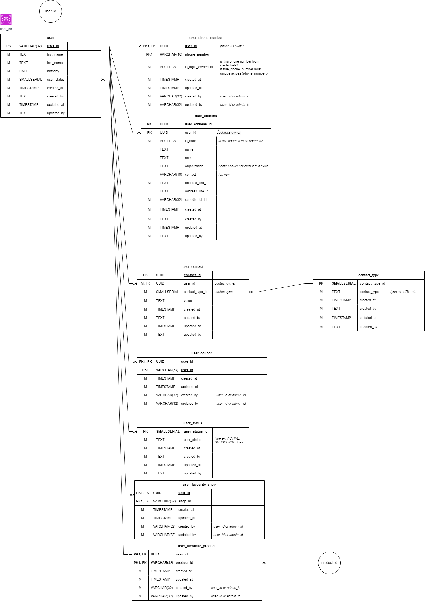
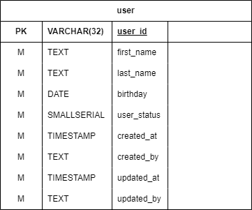
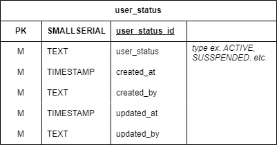
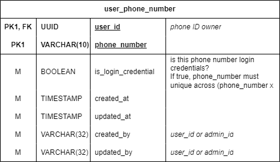
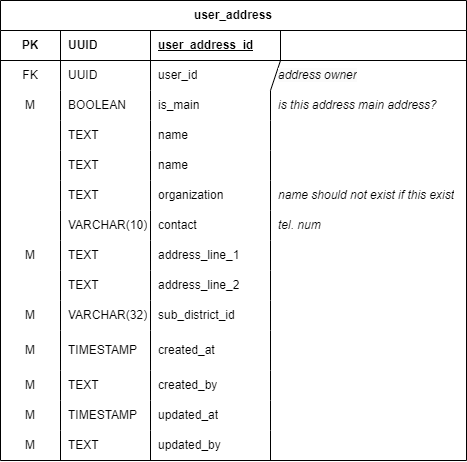
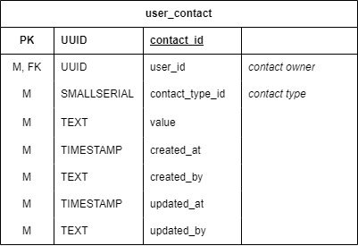
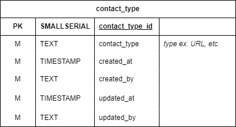
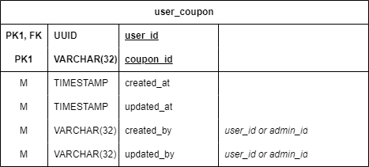
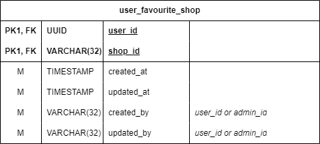
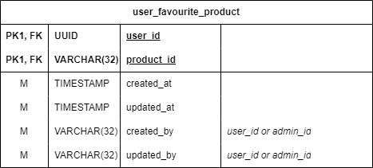

# User service

### Overview

<figure><figcaption>
ฐานข้อมูลใน user service
</figcaption></figure>

ฐานข้อมูล User เป็นฐานข้อมูลที่เก็บข้อมูลที่เกี่ยวข้องกับ[ผู้ใช้ทั่วไป](../../../overview/target-groups.md) อยู่ภายใต้ User service โดยหลักๆจะใช้กับการเก็บข้อมูลของผู้ใช้ 

### ตารางภายในฐานข้อมูล

#### user

<figure><figcaption>
ตาราง user
</figcaption></figure>

ตาราง user ใช้เก็บข้อมูลทั่วไปที่เกี่ยวข้องกับผู้ใช้ และบริการอื่นจะเรียกหาผู้ใช้ใช้จากตารางนี้

##### รายละเอียดของฟิลด์

| ชื่อฟิลด์ | ประเภทข้อมูล | คำอธิบาย |
| :--- | :--- | :--- |
| user_id | UUID | รหัสของผู้ใช้ |
| first_name | TEXT | ชื่อจริงของผู้ใช้ รวมไปถึงชื่อกลาง |
| last_name | TEXT | นามสกุลของผู้ใช้ |
| birthday | DATE | วันเกิดของผู้ใช้ |
| user_status | SMALLSERIAL | [สถานะของผู้ใช้](#user_status)ในรูปรหัส\* |

*\*หากผู้ใช้ร้องขอที่จะลบข้อมูลของผู้ใช้ ข้อมูลของผู้ใช้จะถูกเปลี่ยนเป็นสถานะที่<u>ใช้งานไม่ได้</u>แทนที่จะถูกลบออกจากฐานข้อมูล*

#### user\_status

<figure><figcaption>
ตาราง user_status
</figcaption></figure>

ตาราง user_status ใช้เก็บข้อมูลที่เกี่ยวข้องกับสถานะของผู้ใช้

##### รายละเอียดของฟิลด์

| ชื่อฟิลด์ | ประเภทข้อมูล | คำอธิบาย |
| :--- | :--- | :--- |
| user_status_id | SMALLSERIAL | รหัสของสถานะของผู้ใช้ |
| user_status | TEXT | ชื่อของสถานะของผู้ใช้ เช่น ACTIVE, SUSPEND, DELETE เป็นต้น |

#### user\_phone\_number

<figure><figcaption>
ตาราง user_phone_number
</figcaption></figure>

ตาราง user_phone_number ใช้เก็บข้อมูลที่เกี่ยวข้องกับหมายเลขโทรศัพท์ของผู้ใช้

##### รายละเอียดของฟิลด์

| ชื่อฟิลด์ | ประเภทข้อมูล | คำอธิบาย |
| :--- | :--- | :--- |
| user_id | UUID | [รหัสของผู้ใช้ที่เป็นเจ้าของหมายเลขโทรศัพท์](#user) |
| phone_number | VARCHAR(10) | หมายเลขโทรศัพท์ของผู้ใช้ |
| is_login_credential | BOOLEAN | บอกว่าหมายเลขโทรศัพท์นี้เป็นข้อมูลที่ใช้ในการเข้าสู่ระบบหรือไม่ หากใช่ หมายเลขโทรศัพท์จะซ้ำกับผู้ใช้อื่นไม่ได้ |

#### user\_address

<figure><figcaption>
ตาราง user_address
</figcaption></figure>

ตาราง user_address ใช้เก็บข้อมูลที่เกี่ยวข้องกับที่อยู่ของผู้ใช้

##### รายละเอียดของฟิลด์

| ชื่อฟิลด์ | ประเภทข้อมูล | คำอธิบาย |
| :--- | :--- | :--- |
| user_address_id | UUID | รหัสของที่อยู่ |
| user_id | UUID | [รหัสของผู้ใช้ที่เป็นเจ้าของที่อยู่](#user) |
| is_main | BOOLEAN | บอกว่าที่อยู่นี้เป็นที่อยู่หลักของผู้ใช้หรือไม่ |
| name | TEXT | ชื่อที่อยู่ เช่น บ้าน, ที่ทำงาน, อื่นๆ |
| organization | TEXT | ชื่อขององค์กรที่เกี่ยวข้องกับที่อยู่ |
| contact | VARCHAR(10) | หมายเลขโทรศัพท์ที่เกี่ยวข้องกับที่อยู่ |
| address_line_1 | TEXT | บ้านเลขที่ หมู่ ซอย ถนน และอื่นๆ |
| address_line_2 | TEXT | อาคาร หมู่บ้าน หรืออื่นๆ |
| sub\_district\_id | UUID | [รหัสของตำบล](../miscellaneous/district-service.md#sub_district) |

#### user\_contact

<figure><figcaption>
ตาราง user_contact
</figcaption></figure>

ตาราง user_contact ใช้เก็บข้อมูลที่เกี่ยวข้องกับการติดต่อผู้ใช้

##### รายละเอียดของฟิลด์

| ชื่อฟิลด์ | ประเภทข้อมูล | คำอธิบาย |
| :--- | :--- | :--- |
| contact_id | UUID | รหัสของการติดต่อ |
| user_id | UUID | [รหัสของผู้ใช้ที่เป็นเจ้าของการติดต่อ](#user) |
| contact_type_id | SMALLSERIAL | [รหัสของประเภทของการติดต่อ](#contact_type) |
| value | TEXT | ค่าของการติดต่อ เช่น อีเมล, หมายเลขโทรศัพท์, และอื่นๆ |

#### contact\_type

<figure><figcaption>
ตาราง contact_type
</figcaption></figure>

ตาราง contact_type ใช้เก็บข้อมูลที่เกี่ยวข้องกับประเภทของการติดต่อ

##### รายละเอียดของฟิลด์

| ชื่อฟิลด์ | ประเภทข้อมูล | คำอธิบาย |
| :--- | :--- | :--- |
| contact_type_id | SMALLSERIAL | รหัสของประเภทของการติดต่อ |
| contact_type | TEXT | ชื่อของประเภทของการติดต่อ เช่น อีเมล, หมายเลขโทรศัพท์, และอื่นๆ |

#### user\_coupon

<figure><figcaption>
ตาราง user_coupon
</figcaption></figure>

ตาราง user_coupon ใช้เก็บข้อมูลที่เกี่ยวข้องกับคูปองที่ผู้ใช้มีอยู่

##### รายละเอียดของฟิลด์

| ชื่อฟิลด์ | ประเภทข้อมูล | คำอธิบาย |
| :--- | :--- | :--- |
| user_coupon_id | UUID | [รหัสของคูปอง](../shop-and-transaction/coupon-service.md) |
| user_id | VARCHAR(32) | [รหัสของผู้ใช้ที่เป็นเจ้าของคูปอง](#user) |

#### user\_favorite\_shop

<figure><figcaption>
ตาราง user_favorite_shop
</figcaption></figure>

ตาราง user_favorite_shop ใช้เก็บข้อมูลที่เกี่ยวข้องกับร้านค้าที่ผู้ใช้ชื่นชอบ

##### รายละเอียดของฟิลด์

| ชื่อฟิลด์ | ประเภทข้อมูล | คำอธิบาย |
| :--- | :--- | :--- |
| user_id | UUID | [รหัสของผู้ใช้ที่เป็นเจ้าของร้านค้าที่ชื่นชอบ](#user) |
| shop_id | VARCHAR(32) | [รหัสของร้านค้าที่ผู้ใช้ชื่นชอบ](../shop-and-transaction/shop-service.md) |

#### user\_favorite\_product

<figure><figcaption>
ตาราง user_favorite_product
</figcaption></figure>

ตาราง user_favorite_product ใช้เก็บข้อมูลที่เกี่ยวข้องกับสินค้าที่ผู้ใช้ชื่นชอบ

##### รายละเอียดของฟิลด์

| ชื่อฟิลด์ | ประเภทข้อมูล | คำอธิบาย |
| :--- | :--- | :--- |
| user_id | UUID | [รหัสของผู้ใช้ที่เป็นเจ้าของสินค้าที่ชื่นชอบ](#user) |
| product_id | VARCHAR(32) | [รหัสของสินค้าที่ผู้ใช้ชื่นชอบ](../shop-and-transaction/product-service.md) |

