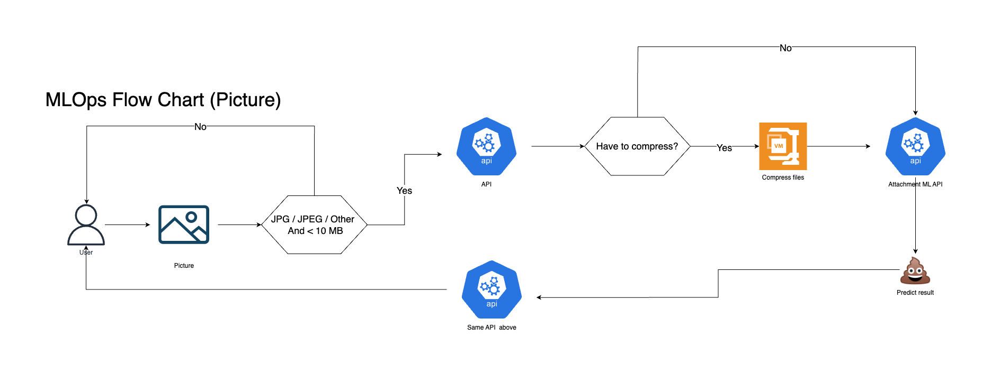

# ML API

## Pipeline

<figure><figcaption>
รูปภาพแสดงการทำงานของ Machine Learning Pipeline
</figcaption></figure>

### End-to-End MLOps

จากรูปภาพข้างต้น เป็นกระบวนกาารทำงานตั้งแต่การรับรูปภาพจากผู้ใช้จนถึงการส่งผลลัพธ์ไปยังผู้ใช้&#x20;

โดยมีAPI รับรูปภาพจากผู้ใช้ จากนั้นส่งเข้า **Attachment API** เพื่อความปลอดภัยและทำการบีบอัดไฟล์ ก่อนส่งไปที่ **ML API** เพื่อให้โมเดลทำนายภาพและส่งผลลัพธ์กลับมา และนำผลลัพธ์ที่ได้ส่งผ่านAPI เพื่อแสดงผลไปยังผู้ใช้

#### ML API

เป็นAPI ที่มีตัวโมเดลที่สมบูรณ์แล้วอยู่ใน Container นี้ เนื่องจากทำการเทรนโมเดลแยกส่วนจากตรงนี้  โดยจะdeploy โมเดลขึ้นสู่ service ด้วย Amazon SageMaker

#### ทำไมถึงใช้ Amazon SageMaker?

* ทีมพัฒนาสามารถทำงานร่วมกันได้อย่างมีประสิทธิภาพ
* มีระบบที่ช่วยให้นักพัฒนาซอฟต์แวร์สามารถautomate การเทรนโมเดล ML
* สามารถdeploy และจัดการโมเดลในproduction
* สามารถติดตามและบำรุงรักษา(maintain)การเปลี่ยนแปลงของโมเดลได้ (model versions)
* มี CI/CD สำหรับการintegrate และ deploy อัติโนมัติ
* สามารถมอนิเตอร์โมเดลอย่างต่อเนื่อง เพื่อคงคุณภาพได้
* ลดต้นทุนและเพิ่มประสิทธิภาพในการทำงานของโมเดล
* รองรับหลายภาษาและไลบรารี่ที่เกี่ยวข้องกับML เช่น Python, Tensorflow
* มีชุดเครื่องมือที่หลากหลายสำหรับงานML ที่มีประสิทธิภาพสูงและต้นทุนต่ำ

