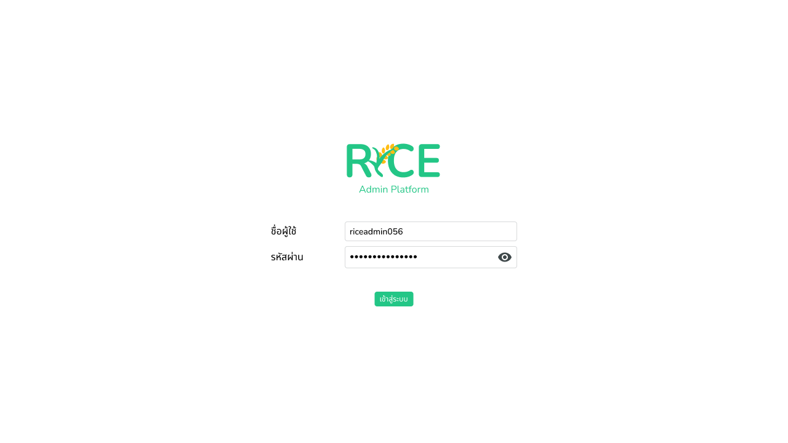
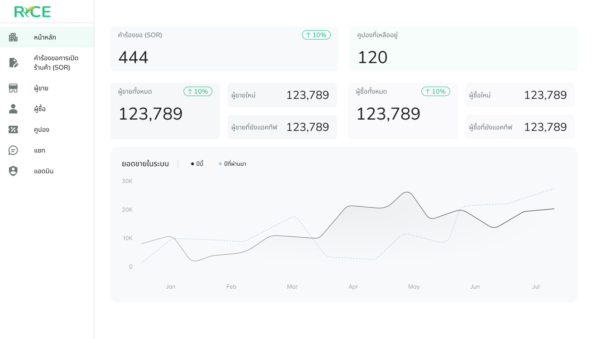

# Admin

### Login

ในการเข้าสู่เว็บไซต์ของแอดมิน จะต้องการทำการล็อคอินก่อนเท่านั้น

<figure><figcaption></figcaption></figure>

---

### Dashboard

เมื่อเข้ามาในเว็บไซต์ของแอดมิน จะพบกับ Dashboard ที่จะแสดงค่าสถิติของ

1. จำนวนคำร้องของ SOR ทั้งหมด
2. จำนวนผู้ขายทั้งหมด และ จำนวนผู้ขายใหม่, ผู้ขายที่ยังแอคทีฟ
3. จำนวนผู้ซื้อทั้งหมด และ จำนวนผู้ซื้อใหม่, ผู้ซื้อที่ยังแอคทีฟ
4. จำนวนคูปองที่เหลืออยู่

<figure><figcaption></figcaption></figure>

---

### Shop Open Request (SOR)

คือคำร้องขอที่ผู้ใช้ได้ลงทะเบียนเป็นร้านค้า โดยแอดมินต้องพิจารณาคำร้องขอเหล่านี้เพื่อให้ผู้ใช้ได้ดำเนินการในการเป็นผู้ขายต่อไป

- Overall List
  แสดงข้อมูล List ของ SOR ทั้งหมด โดยมีสถานะคือ
  1. กำลังรอ
  2. แก้ไข
  3. ปฎิเสธ
  4. อนุมัติ

<figure><figcaption></figcaption></figure>

- Detail page
  แสดงข้อมูล SOR ที่ต้องการ โดยสามารถกด
  - ปฎิเสธคำร้องขอ
  - ขอให้แก้ไขร้องขอ
  - อนุมัติคำร้องขอ

<figure><figcaption></figcaption></figure>

- Approve request
  หากแอดมินอนุมัติ SOR ร้านค้านี้จะปรากฎอยู่ในระบบ และผู้ใช้ที่เกี่ยวข้องกับร้านค้านี้จะสามารถจัดการร้านค้าได้

<figure><figcaption></figcaption></figure>

- Deny request
  หากแอดมินปฎิเสธ SOR ร้านค้านี้จะไม่ปรากฎในระบบ และผู้ใช้ต้องทำการลงทะเบียนร้านค้าใหม่อีกครั้ง

<figure><figcaption></figcaption></figure>

- Request fix request
  หากแอดมินขอให้แก้ไข SOR นี้ ผู้ใช้ที่เป็นผู้ลงทะเบียนร้านค้าต้องทำการแก้ไขข้อมูลต่าง ๆ ที่แอดมินเลือกและบอกเหตุผลในการแก้ไข จากนั้นจึงส่ง SOR เข้ามาใหม่อีกครั้ง

<figure><figcaption></figcaption></figure>

---

### Seller management

สำหรับการจัดการร้านค้าที่มีอยู่ในระบบ

- Seller List
  แสดงข้อมูล List ร้านค้าที่มีอยู่ในระบบ

<figure><figcaption></figcaption></figure>

- Seller detail
  แสดงข้อมูลทั่วไปของร้านค้า

<figure><figcaption></figcaption></figure>

- Seller product list
  แสดง List ข้อมูลสินค้าที่มีอยู่ในร้านค้าปัจจุบัน เมื่อกดที่ List อันใดอันหนึ่ง จะพบกับ Product detail ของสินค้านั้น ๆ

<figure><figcaption></figcaption></figure>

- Product detail
  แสดงข้อมูลทั่วไปของสินค้าปัจจุบัน

<figure><figcaption></figcaption></figure>

- Product review
  แสดง List ความคิดเห็นที่มีต่อสินค้าที่มีอยู่ในร้านค้าปัจจุบัน เมื่อกดที่ List อันใดอันหนึ่ง จะพบกับ Review detail ของสินค้านั้น ๆ

<figure><figcaption></figcaption></figure>

- Product review
  แสดงข้อมูลความคิดเห็นที่มีต่อสินค้าปัจจุบัน

<figure><figcaption></figcaption></figure>

- Seller order list
  แสดง List ข้อมูลการสั่งซื้อสินค้าที่มีอยู่ในร้านค้าปัจจุบัน เมื่อกดที่ List อันใดอันหนึ่ง จะพบกับ Order detail ของสินค้านั้น ๆ

<figure><figcaption></figcaption></figure>

- Seller order detail
  แสดงข้อมูลการสั่งซื้อสินค้าปัจจุบัน

<figure><figcaption></figcaption></figure>

- Seller report list
  แสดง List ข้อมูลการรายงานที่มีอยู่ในร้านค้าปัจจุบัน เมื่อกดที่ List อันใดอันหนึ่ง จะพบกับ Report detail ของสินค้านั้น ๆ

<figure><figcaption></figcaption></figure>

- Seller report detail
  แสดงข้อมูลการรายงานร้านค้าปัจจุบัน

<figure><figcaption></figcaption></figure>

- Ban seller
  อีกหนึ่งสิ่งที่แอดมินสามารถทำได้คือการแบนร้านค้า หากร้านค้านั้น ๆ ถูกแบนจะไม่สามารถทำการขายสินค้าในแพลตฟอร์ม RICE ได้อีกต่อไป และข้อมูลร้านค้า รวมถึง สินค้าทั้งหมดจะไม่ปรากฎให้ผู้ใช้อื่น ๆ เห็น

<figure><figcaption></figcaption></figure>

---

### Buyer management

สำหรับการจัดการผู้ซื้อที่มีอยู่ในระบบ

- Buyer list
  แสดง List ข้อมูลผู้ซื้อในระบบปัจจุบัน เมื่อกดที่ List อันใดอันหนึ่ง จะพบกับ Buyer detail ของผู้ซื้อนั้น ๆ

<figure><figcaption></figcaption></figure>

- Buyer detail
  แสดงข้อมูลทั่วไปของผู้ซื้อ

<figure><figcaption></figcaption></figure>

- Buyer order history
  แสดง List ข้อมูลการสั่งซื้อของผู้ซื้อ เมื่อกดที่ List อันใดอันหนึ่ง จะพบกับ Order detail ของผู้ซื้อนั้น ๆ

<figure><figcaption></figcaption></figure>

- Buyer order detail
  แสดงข้อมูลการสั่งซื้อของผู้ซื้อ

<figure><figcaption></figcaption></figure>

- Buyer report list
  แสดง List ข้อมูลการรายงานที่มีต่อผู้ซื้อนี้ เมื่อกดที่ List อันใดอันหนึ่ง จะพบกับ Report detail ของผู้ซื้อนั้น ๆ

<figure><figcaption></figcaption></figure>

- Buyer report detail
  แสดงการรายงานที่มีต่อผู้ซื้อ

<figure><figcaption></figcaption></figure>

- Ban Buyer
  อีกหนึ่งสิ่งที่แอดมินสามารถทำได้คือการแบนผู้ซื้อ หากผู้ซื้อนั้น ๆ ถูกแบนจะไม่สามารถทำการซื้อสินค้าในแพลตฟอร์ม RICE ได้อีกต่อไป และข้อมูลผู้ซื้อ รวมถึงทั้งหมดจะไม่ปรากฎให้ผู้ใช้อื่น ๆ เห็น

<figure><figcaption></figcaption></figure>

---

### Coupon management

สำหรับการจัดการคูปองในระบบ

- Coupon list
  แสดง List ข้อมูลคูปองในระบบ เมื่อกดที่ List อันใดอันหนึ่ง จะพบกับ Coupon detail ของคูปองนั้น ๆ

<figure><figcaption></figcaption></figure>

- Coupon detail
  แสดงข้อมูลของคูปองนั้น ๆ

<figure><figcaption></figcaption></figure>

- Create new coupon
  แอดมินสามารถสร้างคูปองได้ โดยกรอกรายละเอียดทั้งหมด จากนั้นระบบจะคำนวณค่าใช้จ่ายโดยประมาณในการสร้างคูปองดังกล่าวขึ้นมา

<figure><figcaption></figcaption></figure>

- Edit coupon
  แอดมินสามารถแก้ไขคูปองได้ โดยแก้ไขได้ทุกข้อมูลของคูปอง

<figure><figcaption></figcaption></figure>

- Delete coupon
  แอดมินสามารถลบคูปองได้ และเมื่อคูปองนั้น ๆ ถูกลบไป ผู้ใช้จะไม่สามารถใช้คูปองนั้นได้อีก แต่หากผู้ใช้ได้ใช้คูปองและจ่ายเงินไปแล้ว ระบบจะทำการยกเว้นให้ กล่าวคือ คูปองนั้น ๆ จะไม่ถือเป็นโมฆะ

<figure><figcaption></figcaption></figure>

---

### Chat

ระบบการสนทนา

- Chat list
  แสดง List การสนทนาที่มีอยู่ในระบบ โดย List ใดที่มีจุดสีเขียวอยู่ หมายถึงแชทนั้น ๆ แอดมินยังไม่เข้าไปอ่าน

<figure><figcaption></figcaption></figure>

- Chat detail
  แสดงรายละเอียดของการสนทนานั้น ๆ

<figure><figcaption></figcaption></figure>

---

### Admin management

ระบบการจัดการแอดมิน

- Admin list
  แสดง List ข้อมูลของแอดมินที่อยู่ในระบบ โดยแอดมินจะมี 2 ตำแหน่งคือ
  - แอดมินหลัก
    แอดมินหลักจะเป็นแอดมินที่สามารถจัดการกับแอดมินทั่วไปได้ และเป็นแอดมินแรกที่เข้าสู่ระบบ โดย username, password ของแอดมินหลักถูก generate ขึ้นมาในระบบภายใน
  - แอดมินทั่วไป
    แอดมินทั่วไปจะสามารถจัดการข้อมูลต่าง ๆ ได้ทั้งหมดในระบบแอดมิน ยกเว้นการจัดการแอดมิน

<figure><figcaption></figcaption></figure>

- Add new admin
  แอดมินหลักจะสามารถสร้างแอดมินใหม่ได้ โดยแอดมินที่ถูกสร้างขึ้นมาจะมีตำแหน่งเป็น **แอดมินทั่วไป**

<figure><figcaption></figcaption></figure>

- Edit admin
  แอดมินหลักจะสามารถแก้ไขแอดมินได้ทุกแอดมิน แต่แอดมินทั่วไปจะสามารถแก้ไขข้อมูลได้เพียงแค่ข้อมูลของตนเองเท่านั้น

<figure><figcaption></figcaption></figure>

- Delete admin
  แอดมินหลักสามารถลบข้อมูลของแอดมินได้ทุกแอดมิน และหากแอดมินนั้น ๆ ถูกลบ จะไม่สามารถเข้าสู่ระบบของเว็บไซต์ในฝั่งแอดมินได้อีก

<figure><figcaption></figcaption></figure>
