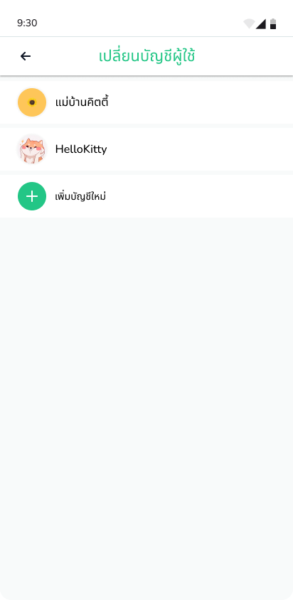

# Buyer

## Dashboard

เมื่่อเข้า Application มาแล้วจะพบกับหน้า Dashboard เป็นอันดับแรก โดยในหน้านี้จะแสดงทั้งหมด 6 section ได้แก่

1. Search Section   User สามารถค้นหาสินค้า และร้านค้าได้
2. Cart Section ในหน้า Dashboard ผู้ใช้สามารถที่จะเห็นสินค้าที่ถูกเลือกลงตะกร้าได้ 
3. Chat Section    ในหน้า Dashboard ผู้ใช้สามารถเห็นว่ามีแก่แชทที่ยังไม่ได้อ่านได้
4. Suggested Product   ในหน้า Dashboard ผู้ใช้สามารถเห็นสินค้าแนะนำประมาณ 4-6 รายการ
5. Product List  ผู้ใช้สามารถเลือกดูรายการสินค้าผ่านหน้า Dashboard ได้
6. User Dashboard  ผู้ใช้สามารถเลือกกดดูหน้า User Dashboard ได้ผ่านทาง Navigation Bar ด้านล่างหน้าจอ

ผู้ใช้สามารถกดเพื่อเข้าไปดูที่ Product ได้ แต่หากจะกดซื้อสินค้า หรือเพิ่มเข้าตะกร้า ผู้ใช้จะต้อง Login ก่อนถึงจะสามารถซื้อสินค้า หรือ เพิ่มสินค้าในรถเข็นได้

<figure><figcaption></figcaption></figure>

<figure><figcaption></figcaption></figure>

## Authentication

### Sign In

หากผู้ใช้มี Account อยู่แล้ว สามารถ Login ผ่าน Email หรือ หมายเลขโทรศัพท์ กับรหัสผ่าน หรือ สามารถ Login ผ่าน Google Facebook Apple และ Line หากผู้ใช้ไม่มี Account ผู้ใช้สามารถกด **สมัครใหม่ที่นี่** เพื่อสร้าง Account ต่อไป

<figure><figcaption></figcaption></figure>

<figure><figcaption></figcaption></figure>
 
<figure><figcaption></figcaption></figure>

---

### Sign Up

หากผู้ใช้ยังไม่มี Account สามารถลงทะเบียนเพื่อสร้าง Account ได้โดยใช้ข้อมูล หมายเลขโทรศัพท์ Email และที่อยู่ หรือสามารถสร้าง Account ผ่าน Google Facebook Apple และ Line

<figure><figcaption></figcaption></figure>
 
<figure><figcaption></figcaption></figure>
 
<figure><figcaption></figcaption></figure>
 
<figure><figcaption></figcaption></figure>

---

## Coupon

ผู้ใช้สามารถกดเลือกคูปองเพื่อนำไปใช้เป็นส่วนลดในการซื้อสินค้า โดยเข้าหน้า Coupon ผ่านทางหน้า Dashboard

<figure><figcaption></figcaption></figure>

---

## Search

Search with Text

ผู้ใช้สามารถค้นหาสินค้า หรือร้านค้า ผ่านทางการพิมพ์ได้ และสามารถเลือกกรองสินค้าที่ต้องการจะดูได้

<figure><figcaption></figcaption></figure>
 
<figure><figcaption></figcaption></figure>
 
<figure><figcaption></figcaption></figure>
 
<figure><figcaption></figcaption></figure>

&#x20;      

Search with Image

ผู้ใช้สามารถค้นหาสินค้า หรือร้านค้า ผ่านรูปภาพได้ โดยกดปุ่ม กล้องถ่ายรูป ที่อยู่ตรงตรงด้านขวาของ Search Bar และสามารถเลือกกรองสินค้าที่ต้องการจะดูได้

<figure><figcaption></figcaption></figure>
 
<figure><figcaption></figcaption></figure>
 
<figure><figcaption></figcaption></figure>
 
<figure><figcaption></figcaption></figure>
 
<figure><figcaption></figcaption></figure>

---

## Shop page

ผู้ใช้สามารถดูรายการสินค้าของร้านค้า รีวิว กดถูกใจร้านค้า Report ร้านค้า และแชทกับร้านค้าได้ผ่านทางหน้า Shop Page

<figure><figcaption></figcaption></figure>
 
<figure><figcaption></figcaption></figure>

---

## Report

ผู้ใช้สามารถรายงานปัญหาที่พบ โดยเลือกหัวข้อที่จะรายงาน และรายงานร้านค้าโดยใส่เหตุผลที่รายงาน และแนบรูปภาพหลักฐาน

<figure><figcaption></figcaption></figure>
 
<figure><figcaption></figcaption></figure>
 
<figure><figcaption></figcaption></figure>

---

## Product detail

หน้า Product Detail ผู้ใช้สามารถดูคำอธิบายสินค้า รีวิวของสินค้า เพิ่มจำนวนสินค้าที่ต้องการจะซื้อ และสามารถกดเพื่อดูหน้าร้านค้าผ่านหน้า Product Detail ได้ และเมื่อผู้ใช้สนใจสินค้าสามารถกดซื้อ หรือเพิ่มสินค้าเข้ารถเข็นได้

<figure><figcaption></figcaption></figure>
 
<figure><figcaption></figcaption></figure>

---

## Cart

เมื่อผู้ใช้สนใจสินค้า แต่ยังไม่ได้จะซื้อทันที สามารถกดปุ่ม เพิ่มสินค้าเข้ารถเข็น เมื่อมาดูที่หน้า Cart ก็จะสามารถดูรายการสินค้าที่ตนเองได้กดเพิ่มมาได้ หากผู้ใช้สนใจที่จะซื้อสินค้าสามารถกด checkbox สีเขียวที่แยู่ด้านหน้ารูปสินค้า และกดซื้อสินค้า เพื่อทำการชำระเงินต่อไปได้ หากผู้ใช้ต้องการลบรายการสินค้าออกจากรถเข็นสามารถสไลด์ซ้าย หรือกดปุ่มลบสินค้าเพื่อทำการลบสินค้า

<figure><figcaption></figcaption></figure>

---

## Payment

เมื่อผู้ใช้ตัดสินใจซื้อสินค้า จำเป็นต้องมีข้อมูลของที่อยู่จัดส่งก่อนจึงจะสามารถซื้อสินค้าได้ หากผู้ใช้ยังไม่มีข้อมูลที่อยู่จัดส่งใน Application สามารถเพิ่มได้ หากเพิ่มที่ิอยู่จัดส่งแล้ว รายละเอียดของที่อยู่จัดส่งจะแสดงออกทางหน้าจอ แล้วกดปุ่ม *สั่งสินค้า* เพื่อซื้อสินค้า เมื่อชำระเงินเสร็จสิ้น Application จะ Navigate ไปหน้า Dashboard อีกครั้ง

<figure><figcaption></figcaption></figure>

<figure><figcaption></figcaption></figure>
 
<figure><figcaption></figcaption></figure>

---

## History

ผู้ใช้สามารถตรวจสอบประวัติการทำรายการของตนเองได้ที่หน้า History โดยจะแบ่งสถานะการทำรายการออกเป็น 3 สถานะ ได้แก่ ที่ต้องชำระ ที่ต้องได้รับ และ สำเร็จ

### ที่ต้องชำระ

แสดงรายการสินค้าที่ยังไม่ได้ชำระเงิน

### ที่ต้องได้รับ

แสดงรายการสินค้าที่ชำระเงินสำเร็จแล้ว และรอการจัดส่ง

### สำเร็จ

แสดงรายการสินค้าที่จัดส่งสำเร็จแล้ว ผู้ใช้สามารถกดปุ่ม *รีวิวสินค้า* เพื่อไปหน้า Review เพื่อรีวิวสินค้าได้

<figure><figcaption></figcaption></figure>
 
<figure><figcaption></figcaption></figure>
 
<figure><figcaption></figcaption></figure>

---

## Review

ผู้ใช้สามารถรีวิวสินค้าได้ที่หน้านี้ โดยสามารถเลือกได้ที่จะแสดงชื่อของตนเอง หรือ ไม่ก็ได้ โดยกดที่ *Checkbox แสดงคอมเมนต์แบบไม่ระบุตัวตน* และสามารถแนบรูปสินค้า พร้อมกับเขียนรีวิวเพื่อรีวิวสินค้า โดยเมื่อกดปุ่ม *ส่งคอมเมนต์* คอมเมนต์ของผู้ใช้จะไปปรากฎที่หน้า Shop Page และ Product Detail

<figure><figcaption></figcaption></figure>
 
<figure><figcaption></figcaption></figure>
 
<figure><figcaption></figcaption></figure>

---

## User Dashboard

ในหน้านี้ผู้ใช้สามารถเข้าได้ผ่านทาง Navigation Bar ด้านล่างหน้าจอ เพื่อสามารถทำรายการต่างๆได้ โดยการที่จะสามารถทำรายการได้ผู้ใช้จำเป็นต้อง Login ก่อนจึงจะสามารถทำรายการต่อไปนี้ได้ ได้แก่ 

<figure><figcaption></figcaption></figure>

<figure><figcaption></figcaption></figure>

### ดูโปรไฟล์

แสดงข้อมูลบัญชีของผู้ใช้

<figure><figcaption></figcaption></figure>

### ตั้งค่าบัญชี

ตั้งค่าข้อมูลบัญชีของผู้ใช้

<figure><figcaption></figcaption></figure>

### ร้านค้าโปรด

แสดงรายการของร้านค้าที่ผู้ใช้ได้เคยกดถูกใจเอาไว้

<figure><figcaption></figcaption></figure>

### สินค้าที่ชอบ

แสดงรายการสินค้าที่ผู้ใช้ได้เคยกดถูกใจไว้

<figure><figcaption></figcaption></figure>

### คุยกับ Rice

ติดต่อกับแอดมินของ RICE

<figure><figcaption></figcaption></figure>
 
<figure><figcaption></figcaption></figure>
 
<figure><figcaption></figcaption></figure>

### สลับบัญชี

สลับบัญชีผู้ใช้ หากผู้ใช้มีหลาย Account 

<figure><figcaption></figcaption></figure>

---

## Chat

แสดงรายการแชทสนทนากับร้านค้าทั้งหมดของผู้ใช้ โดยผู้ใช้สามารถเข้าหน้านี้ได้ผ่านทาง Navigation Bar ด้านล่างหน้าจอ

<figure><figcaption></figcaption></figure>
 
<figure><figcaption></figcaption></figure>
 
<figure><figcaption></figcaption></figure>
 
<figure><figcaption></figcaption></figure>

