# Seller

## Shop Register

หากผู้ขายต้องการที่จะเปิดร้านค้า ผู้ขายจำเป็นต้องมี Account กับทาง RICE ก่อน จึงจะทำการลงทะเบียนเปิดร้านค้าได้ 

<figure>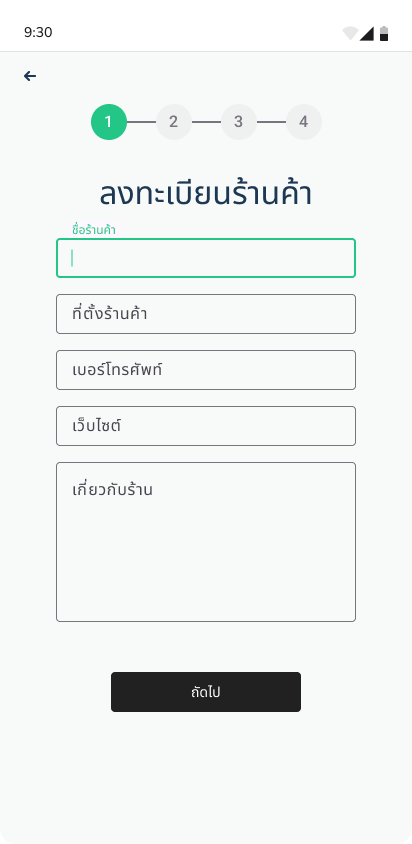<figcaption></figcaption></figure>

<figure>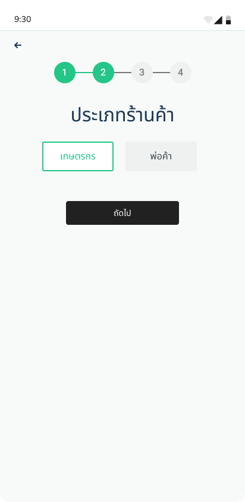<figcaption></figcaption></figure>

<figure>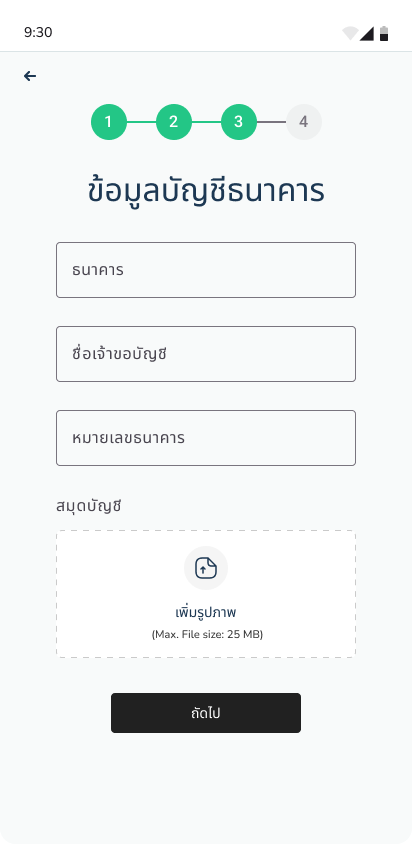<figcaption></figcaption></figure>

<figure>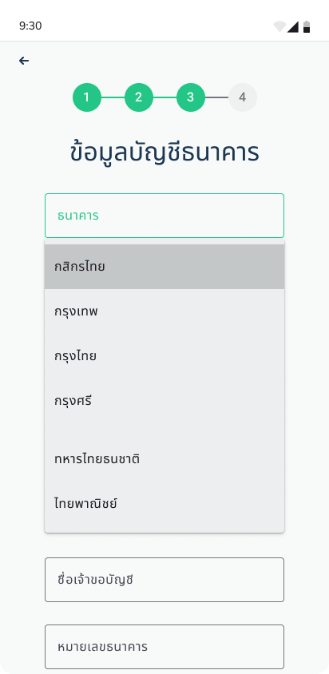<figcaption></figcaption></figure>

<figure>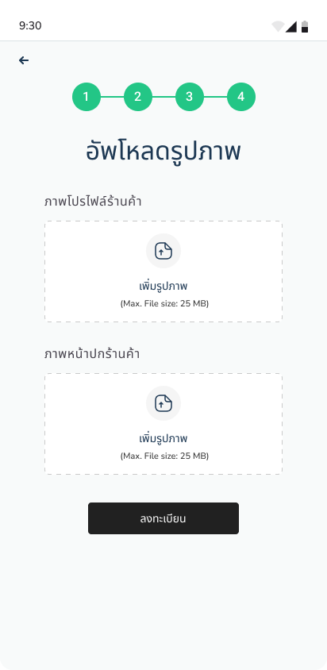<figcaption></figcaption></figure>

### Waiting for Approve

เมื่อทำการลงทะเบียนเปิดร้านค้าเสร็จแล้ว ผู้ขายตะต้องรอการอนุมัติจากแอดมินของทาง RICE

<figure>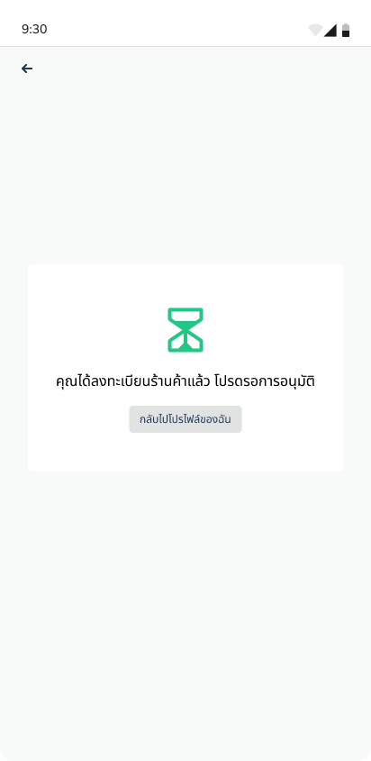<figcaption></figcaption></figure>

---

### Not Approved

หากแอดมินไม่อนุมัติ ผู้ขายจะต้องกลับไปแก้รายละเอียดของร้านค้าอีกครั้ง โดยสามารถแก้ไขรายละเอียดของร้านค้าได้เมื่อกดที่ปุ่ม **แก้ไขข้อมูลร้านค้า** หากกดปุ่ม **กลับไปโปรไฟล์ของฉัน** จะกลับไปที่หน้า User Dashboard ของผั่งผู้ซื้อ (Buyer)

<figure>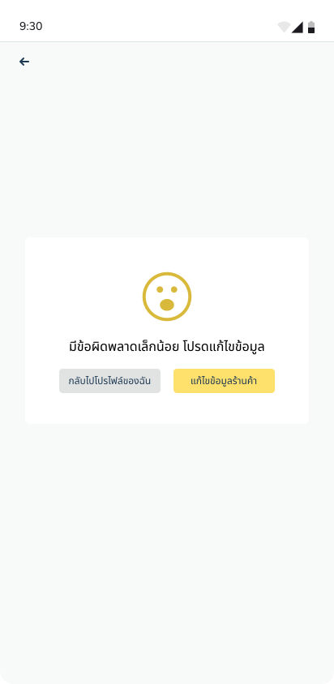<figcaption></figcaption></figure>

#### Edit Shop Detail

แก้รายละเอียดของร้านค้าอีกครั้ง ตามหัวข้อที่แอดมินรายงาน

<figure>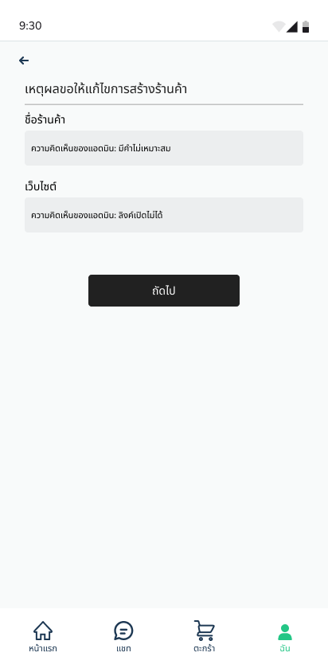<figcaption></figcaption></figure>

<figure>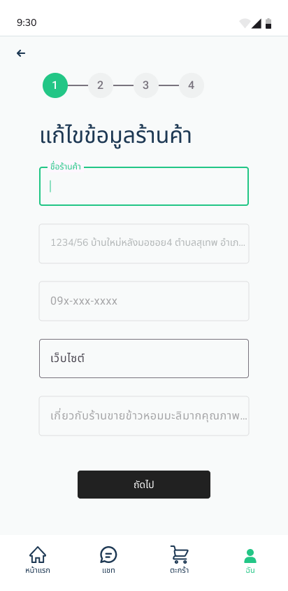<figcaption></figcaption></figure>

<figure>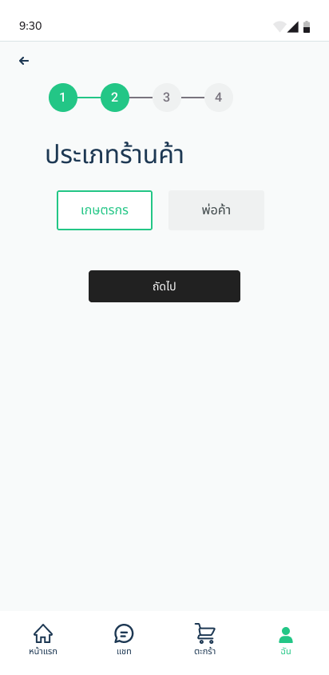<figcaption></figcaption></figure>

<figure>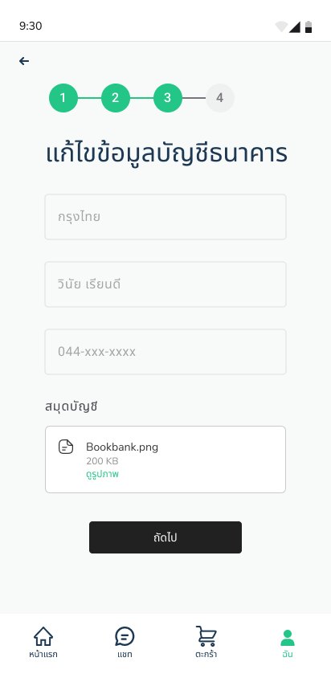<figcaption></figcaption></figure>

<figure>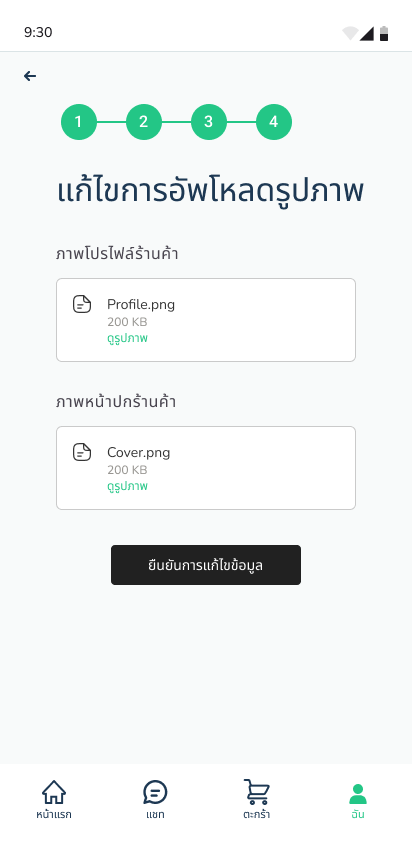<figcaption></figcaption></figure>

---

### Approved

เมื่อแอดมินทาง RICE ตรวจสอบรายละเอียดของร้านค้าที่ผู้ขายส่งมาแล้วอนุมัติ ผู้ขายสามารถกดปุ่ม **หน้าโปรไฟล์ร้านค้าของฉัน** เพื่อไปที่หน้า Shop Page

<figure>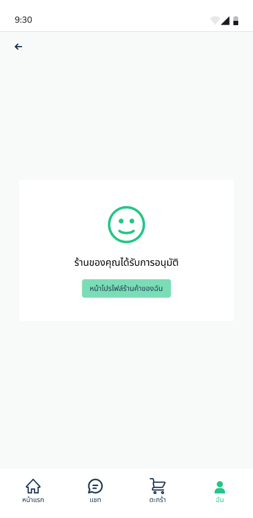<figcaption></figcaption></figure>

## Shop Page

### Detail

แสดงรายละเอียดของร้านค้า โดยมีข้อมูลของร้านค้า และข้อมูลบัญชีธนาคสรของผู้ขาย โดยสามารถกดแก้ไขรายละเอียดของร้านค้าได้ผ่านทางปุ่ม **แก้ไข**

<figure>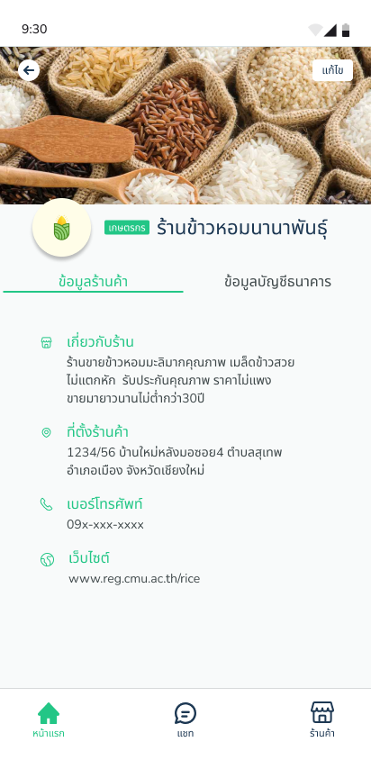<figcaption></figcaption></figure>

<figure>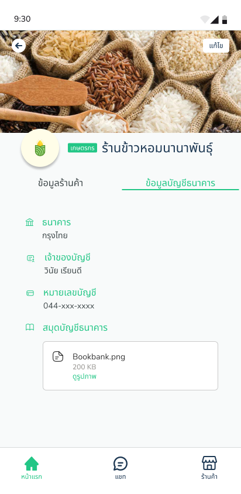<figcaption></figcaption></figure>

---

### Edit&#x20;

ในหน้านี้ผู้ขายสามารถแก้ไขรายละเอียดของร้านค้า ข้อมูลบัญชี ธนาคาร ชื่อร้าน รูปโปรไฟล์ของร้าน และรูปปกของร้านได้

<figure>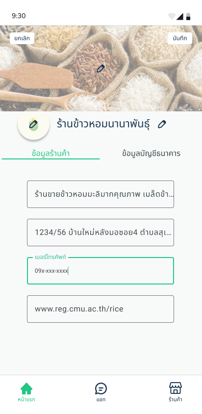<figcaption></figcaption></figure>

<figure>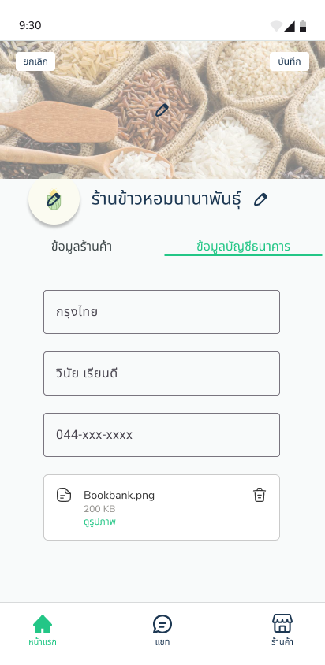<figcaption></figcaption></figure>

<figure>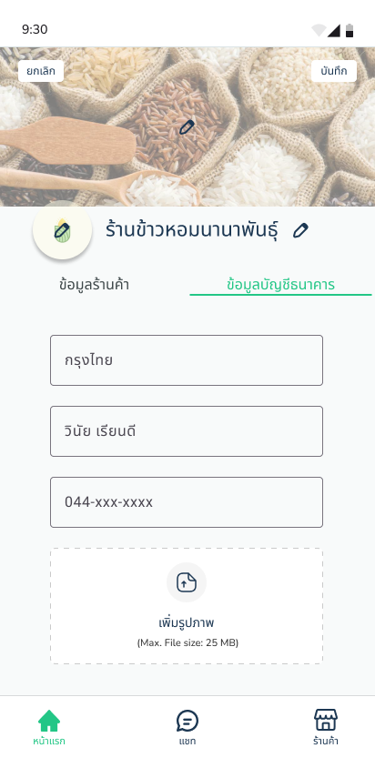<figcaption></figcaption></figure>

## Chat

หน้า Chat สามารถเข้าได้ผ่านทาง Navigation Bar ด้านล่างหน้าจอ โดยในหน้านี้จะแสดงรายการสนธนาทั้งหมดที่ผู้ขายได้คุยกับลูกค้าไว้

<figure>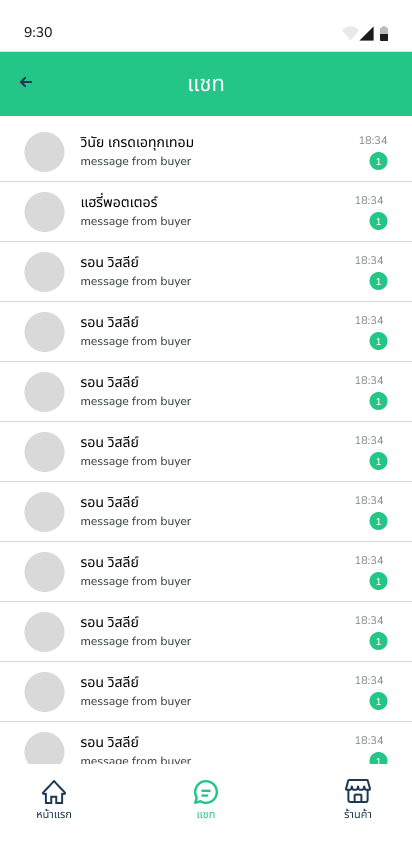<figcaption></figcaption></figure>

## Shop Management

### Dashboard

ในหน้า Dashboard ของ Shop Management จะแสดง Banner ซึ่งมีรายละเอียดเป็น ชื่อร้านค้า ปกร้านค้า ปุ่ม **ข้อมูลร้านค้า** หากผู้ขายกดจะพาผู้ขายไปยังหน้า [#shop-page](seller.md#shop-page "mention") และหากกดปุ่ม **ดูร้านค้า**

<figure>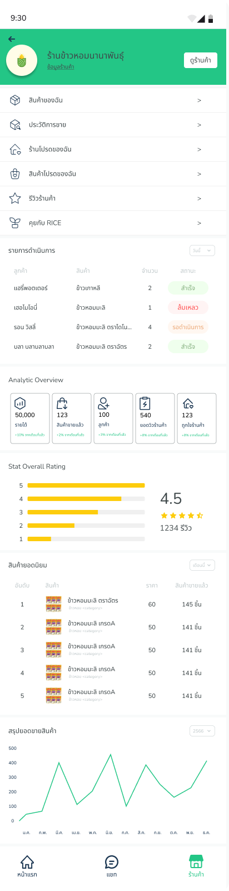<figcaption></figcaption></figure>

#### Shop Product List

<figure><figcaption></figcaption></figure>

<figure>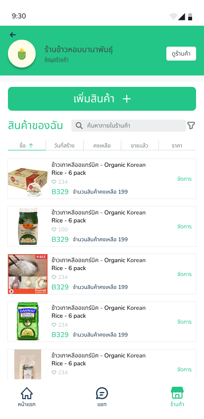<figcaption></figcaption></figure>

<figure><figcaption></figcaption></figure>

#### Shop Order

[#order-history](seller.md#order-history "mention")

#### Favorite Shop

<figure><figcaption></figcaption></figure>

#### Review

<figure>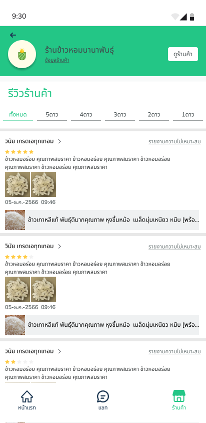<figcaption></figcaption></figure>

<figure>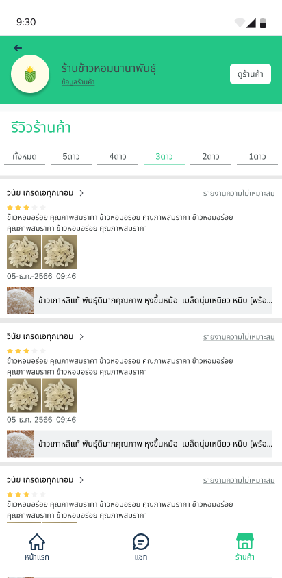<figcaption></figcaption></figure>

#### Report

<figure><figcaption></figcaption></figure>

<figure><figcaption></figcaption></figure>

<figure><figcaption></figcaption></figure>

#### Chat with Rice

<figure><figcaption></figcaption></figure>

---

### Add Product

<figure><figcaption></figcaption></figure>

<figure><figcaption></figcaption></figure>

<figure><figcaption></figcaption></figure>

<figure><figcaption></figcaption></figure>

---

### Product Detail

<figure>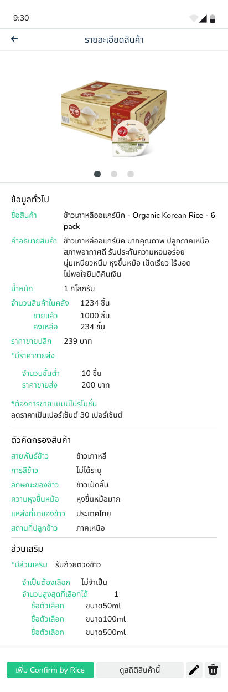<figcaption></figcaption></figure>

---

#### edit

<figure><figcaption></figcaption></figure>

<figure><figcaption></figcaption></figure>

#### delete product

<figure>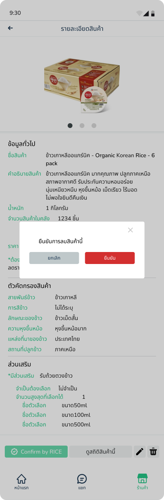<figcaption></figcaption></figure>

---

### Order History

<figure>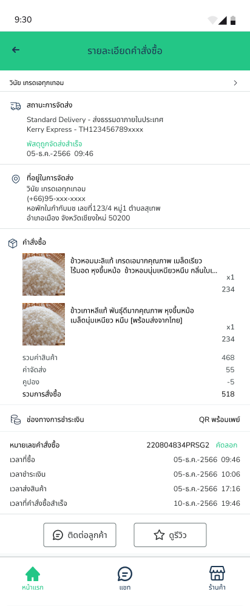<figcaption></figcaption></figure>

#### Waiting for purchase

<figure>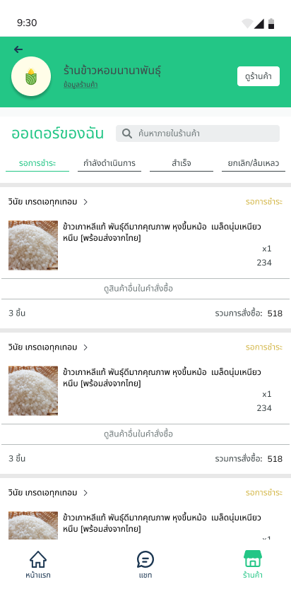<figcaption></figcaption></figure>

#### On-going

<figure>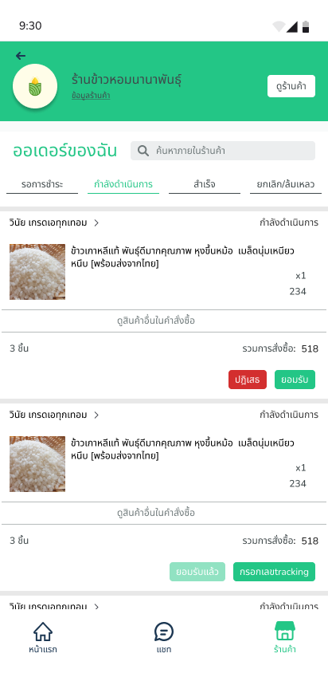<figcaption></figcaption></figure>

#### Accept/Decline order

Submit tracking number

<figure>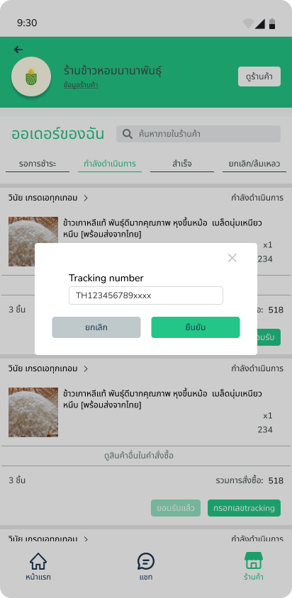<figcaption></figcaption></figure>

Deny Order

<figure><figcaption></figcaption></figure>

#### View status of order

Success Order

<figure>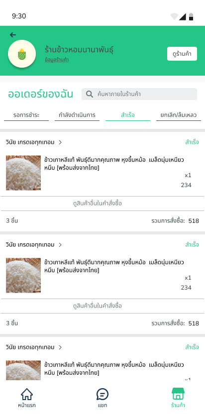<figcaption></figcaption></figure>

Fail Order

<figure><figcaption></figcaption></figure>

---

### Stat

<figure>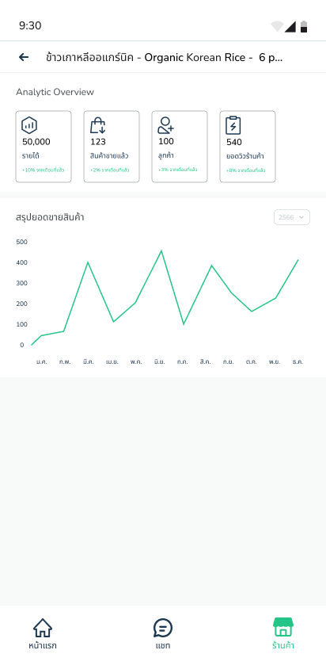<figcaption></figcaption></figure>
