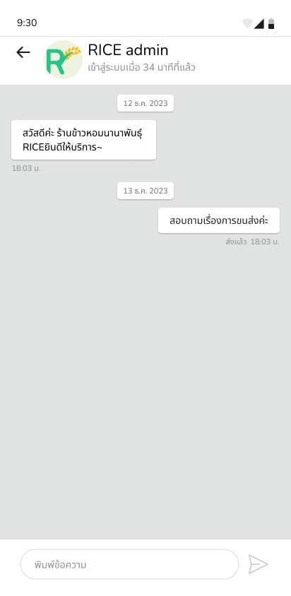

# Seller

## Shop Register

หากผู้ขายต้องการที่จะเปิดร้านค้า ผู้ขายจำเป็นต้องมี Account กับทาง RICE ก่อน จึงจะทำการลงทะเบียนเปิดร้านค้าได้ 

<figure><figcaption></figcaption></figure>

<figure><figcaption></figcaption></figure>

<figure><figcaption></figcaption></figure>

<figure><figcaption></figcaption></figure>

<figure><figcaption></figcaption></figure>

### Waiting for Approve

เมื่อทำการลงทะเบียนเปิดร้านค้าเสร็จแล้ว ผู้ขายตะต้องรอการอนุมัติจากแอดมินของทาง RICE

<figure><figcaption></figcaption></figure>

---

### Not Approved

หากแอดมินไม่อนุมัติ ผู้ขายจะต้องกลับไปแก้รายละเอียดของร้านค้าอีกครั้ง โดยสามารถแก้ไขรายละเอียดของร้านค้าได้เมื่อกดที่ปุ่ม **แก้ไขข้อมูลร้านค้า** หากกดปุ่ม **กลับไปโปรไฟล์ของฉัน** จะกลับไปที่หน้า User Dashboard ของผั่งผู้ซื้อ (Buyer)

<figure><figcaption></figcaption></figure>

#### Edit Shop Detail

แก้รายละเอียดของร้านค้าอีกครั้ง ตามหัวข้อที่แอดมินรายงาน

<figure><figcaption></figcaption></figure>

<figure><figcaption></figcaption></figure>

<figure><figcaption></figcaption></figure>

<figure><figcaption></figcaption></figure>

<figure><figcaption></figcaption></figure>

---

### Approved

เมื่อแอดมินทาง RICE ตรวจสอบรายละเอียดของร้านค้าที่ผู้ขายส่งมาแล้วอนุมัติ ผู้ขายสามารถกดปุ่ม **หน้าโปรไฟล์ร้านค้าของฉัน** เพื่อไปที่หน้า Shop Page

<figure><figcaption></figcaption></figure>

## Shop Page

### Detail

แสดงรายละเอียดของร้านค้า โดยมีข้อมูลของร้านค้า และข้อมูลบัญชีธนาคสรของผู้ขาย โดยสามารถกดแก้ไขรายละเอียดของร้านค้าได้ผ่านทางปุ่ม **แก้ไข**

<figure><figcaption></figcaption></figure>

<figure><figcaption></figcaption></figure>

---

### Edit&#x20;

ในหน้านี้ผู้ขายสามารถแก้ไขรายละเอียดของร้านค้า ข้อมูลบัญชี ธนาคาร ชื่อร้าน รูปโปรไฟล์ของร้าน และรูปปกของร้านได้

<figure><figcaption></figcaption></figure>

<figure><figcaption></figcaption></figure>

<figure><figcaption></figcaption></figure>

## Chat

หน้า Chat สามารถเข้าได้ผ่านทาง Navigation Bar ด้านล่างหน้าจอ โดยในหน้านี้จะแสดงรายการสนธนาทั้งหมดที่ผู้ขายได้คุยกับลูกค้าไว้

<figure><figcaption></figcaption></figure>

## Shop Management

### Dashboard

ในหน้า Dashboard ของ Shop Management จะแสดง Banner ซึ่งมีรายละเอียดเป็น ชื่อร้านค้า ปกร้านค้า ปุ่ม **ข้อมูลร้านค้า** หากผู้ขายกดจะพาผู้ขายไปยังหน้า [#shop-page](seller.md#shop-page "mention") และหากกดปุ่ม **ดูร้านค้า** จะแสดงหน้าร้านค้าในมุมมองของผู้ซื้อ [#shop-page](buyer.md#shop-page "mention") 

&nbsp;&nbsp;&nbsp;&nbsp;นอกจากนี้ผู้ขายสามารถดู รายการดำเนินการ ซึ่งจะแสดงรายการดำเนินการของลูกค้าที่มาซื้อสินค้า และแสดงสถานะการชำระเงิน ลและจำนวนของสินค้าที่ลูกค้าซื้อไปได้

&nbsp;&nbsp;&nbsp;&nbsp;ถัดมาข้างล่างผู้ขายสามารถดู Analysis Overview ซึ่งจะแสดงรายการดังต่อไปนี้ ตามลำดับในรูป

* ยอดรายได้ที่ได้จากการขายสินค้าทั้งหมด

* ยอดจำนวนสินค้าที่ขายได้ทั้งหมด

* จำนวนลูกค้าที่มาซื้อสินค้าทั้งหมด

* ยอดรีวิวร้านค้า

* ยอดถูกใขของร้านค้า

&nbsp;&nbsp;&nbsp;&nbsp;ถัดลงมาจะเป็นการแสดงภาพรวมของรีวิว ตรงตำแหน่ง **Stat Overall Rating** โดยจะแสดงภาพรวมรีวิวสินค้าจากลูกค้าตั้งแต่ 5 ไปจนถึง 1 ดาว

&nbsp;&nbsp;&nbsp;&nbsp;ในส่วนของ **สินค้ายอดนิยม** จะทำการแสดงรายการสินค้าที่มีจำนวนผู้สั่งซื้อมากที่สุด 5 อันดับ พร้อมกับบอกรายละเอียดของสินค้าอย่างเช่น ราคาของสินค้า และ จำนวนชิ้นที่ขายไป

&nbsp;&nbsp;&nbsp;&nbsp;ในส่วนสุดท้ายที่อยู่ตำแหน่งล่างสุดคือ **สรุปยอดขายสินค้า** จะทำการแสดงกราฟที่แสดงจำนวนยอดการสั่งซื้อสินค้าทั้งหมดในแต่ละเดือน

    ในหน้านี้สามารถเข้าถึงหน้าต่างๆของ Application ได้หลากหลายหน้า ซึ่งจะมีการกล่าวอธิบายเพิ่มในหัวข้อถัดไป

<figure><figcaption></figcaption></figure>

### Shop Product List

Feature หลักๆของหน้านี้คือการดูรายการสินค้าทั้งหมดในร้านค้า โดยสามารถแสดงรายการเรียงลำดับจาก ชื่อ วันที่สร้าง จำนวนคงเหลือ สินค้าที่ขายแล้ว และ ราคา โดยผู้ขายสามราถค้นหาชื่อของสินค้าได้ผ่านทาง Search Bar ที่อยู่ด้านบนอีกที นอกจากนี้ผู้ขายสามารถใช้ Filter เพื่อค้นสินค้าตามประเภทของข้าวได้อีกด้วย

&nbsp;&nbsp;&nbsp;&nbsp;ในหน้านี้ยังจะสามารถกดเพิ่มสินค้าที่ผู้ขายต้องการจะขายได้ โดยรายละเอียดของหน้าเพิ่มสินค้าจะอธิบายต่อในหัวข้อ [#add-product](seller.md#add-product "mention")

<figure><figcaption></figcaption></figure>

<figure><figcaption></figcaption></figure>

<figure><figcaption></figcaption></figure>

### Shop Order

ในหน้านี้จะทำการอธิบายหน้าที่ และการทำงานรวมกับหัวข้อ [#order-history](seller.md#order-history "mention")

### Favorite Shop

หน้า Favorite Shop จะแสดงร้านค้าที่ผู้ขายได้กดถูกใจเอาไว้

<figure><figcaption></figcaption></figure>

### Review

หน้านี้จะทำการแสดงยอดรีวิวสินค้า และคอมเมนต์ โดยสามารถกดเลือกดูได้ทั้งรีวิวทั้งหมด และเลือกดูรีวิวและคอมเมนต์ทีละดาวตั้งแต่ 5 ไปจนถึง 1

<figure><figcaption></figcaption></figure>

<figure><figcaption></figcaption></figure>

### Report

ในหน้านี้สามารถเข้าได้ผ่านปุ่ม **รายงานความไม่เหมาะสม** จากหน้า [#review](seller.md#review "mention") ในตำแหน่งด้านบนซ้ายของคอมเมนต์ โดยเมื่อผู้ขายเจอข้อความจากคอมเมนต์ที่ไม่เหมาะสม ผู้ขายสามารถกดรายงานผู้ใช้คนนั้น และเลือกหัวข้อที่จะรายงาน จากนั้นระบุเหตุผล พร้อมแนบรูปภาพหลักฐาน

<figure><figcaption></figcaption></figure>

<figure><figcaption></figcaption></figure>

<figure><figcaption></figcaption></figure>

### Chat with Rice

เมื่อผู้ขายต้องการที่จะติดต่อกับทางบริษัท สามารถติดต่อได้ผ่านทางหน้านี้เพื่อพูดคุยกับทางแอดมินของ RICE

<figure><figcaption></figcaption></figure>

---

### Add Product

ในหน้านี้สามารถเข้าถึงได้ผ่านทางหน้า [#shop-product-list](seller.md#shop-product-list "mention") Feature ของหน้านี้คือการเพิ่มสินค้า โดยผู้ขายจำเป็นต้องรายละเอียดของสินค้าให้ครบตามภาพต่อไปนี้

<figure><figcaption></figcaption></figure>

<figure><figcaption></figcaption></figure>

<figure><figcaption></figcaption></figure>

<figure><figcaption></figcaption></figure>

---

### Product Detail

เป็นหน้าที่แสดงรายละเอียดของสินค้า โดยสามารถกดแก้ไขรายละเอียดของสินค้าได้จากปุ่ม **รูปดินสอ** และหากต้องการลบสินค้าสามารถกดได้ที่ปุ่ม **รูปถังขยะ**

<figure><figcaption></figcaption></figure>

---

#### edit

<figure><figcaption></figcaption></figure>

<figure><figcaption></figcaption></figure>

#### delete product

<figure><figcaption></figcaption></figure>

---

### Order History

เป็นหน้าที่จะแสดงรายละเอียดของคำสั่งซื้อ โดยจะแสดงสถานะของรายการคำสั่งซื้อทั้งหมด 4 สถานะได้แก่ 

#### Waiting for purchase

แสดงรายการสินค้าที่ทางฝั่งของผู้ซื้อ หรือลูกค้ายังไม่ได้ชำระเงิน

<figure><figcaption></figcaption></figure>

#### On-going

แสดงรายการสินค้าที่ได้รับการชำระเงินแล้ว ผู้ขายสามารถเลือกที่จะยอมรับรายการสินค้านั้น หรือ เลือกที่จะปฎิเสธได้

<figure><figcaption></figcaption></figure>

##### Accept/Decline order

###### Submit tracking number

เมื่อผู้ขายกดยอมรับสินค้าแล้ว จำเป็นจะต้องกรอกเลข Tracking Number เพื่อยืนยันรายการสินค้า

<figure><figcaption></figcaption></figure>

###### Deny Order

เมื่อผู้ขายกดปฎิเสธรายการสินค้า จำเป็นจะต้องกรอกเหตุผลที่ปฏิเสธรายการสินค้านั้นให้ผู้ซื้อได้รับทราบ

<figure><figcaption></figcaption></figure>

#### Success Order

แสดงรายการสินค้าที่ได้รับการกดยอมรับแล้ว

<figure><figcaption></figcaption></figure>

#### Fail Order

แสดงรายการสินค้าที่ได้รับการกดปฎิเสธ

<figure><figcaption></figcaption></figure>

---

### View status of order

แสดงสถิติของรายการสินค้าค้านั้น โดยจะแสดง

* ยอดรายได้ที่จากการขายสินค้านั้น

* จำนวนสินค้าที่ถูกขายแล้ว

* จำนวนลูกค้าที่ซื้อสินค้า

* ยอดรีวิวของสินค้า

โดยในส่วนของกราฟ **สรุปยอดขายสินค้า** จะแสดงยอดขายของสินค้าในแต่ละเดือน

<figure><figcaption></figcaption></figure>
