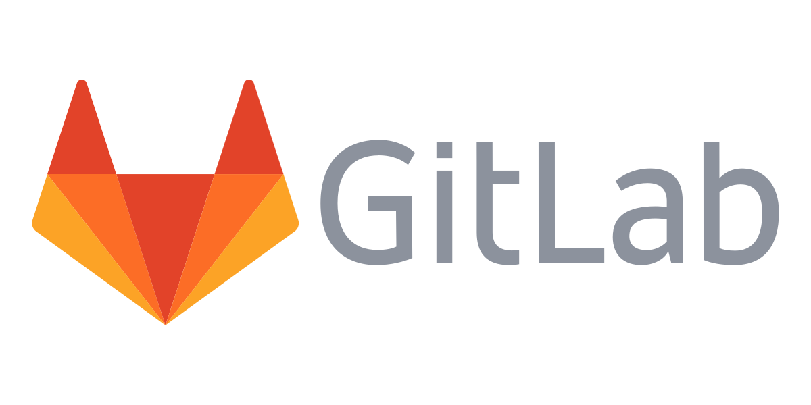

# Source Code Management

<figure><figcaption></figcaption></figure>

* ใช้เวลาในการ maintain เครื่องมือน้อยลง 7 เท่า ทำให้ developer ใช้เวลาที่เหลือไปกับการพัฒนา software ได้มากขึ้น
* #### มี GitLab Duo ที่มี AI ช่วยในเรื่องต่างๆตั้งแต่การเขียน code ไปจนถึงการทำ security
* มีการรักษาความปลอดภัยที่อัตโนมัติ ซึ่งจะช่วยลดภาระงานที่จะต้องทำซ้ำๆได้
* สามารถตรวจสอบการทำงานตั้งแต่ต้นทางถึงปลายทาง
* #### Flexible deployment ซึ่งจะช่วยเรื่องการตัดสินใจว่าจะใช้ platform อะไร ซึ่งจะช่วยในการประหยัดต้นทุน
* ด้วยที่เก็บข้อมูลแบบรวมที่เดียว ทีมบน GitLab จึงสามารถวัดประสิทธิภาพ ประสิทธิผล และตัวชี้วัดสำคัญอื่นๆ ได้ในที่เดียว
