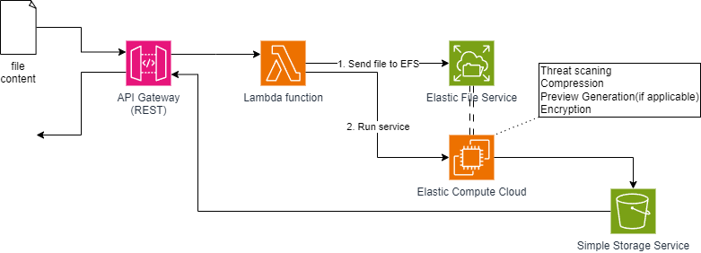
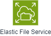
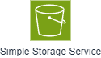

# Attachment Service

<figure><figcaption>
ภาพรวมของ Attachment Service
</figcaption></figure>

Attachments Service คือบริการที่ใช้เก็บข้อมูลของไฟล์ ภายใน RICE อาทิเช่น ภาพร้านค้า ไฟล์แนบภายในแชท และอื่นๆ

โดยจุดประสงค์ของการมี Attachments Service ใน RICE คือ
- การป้องกันไฟล์ที่เป็นอันตรายต่อบริการอื่นๆ และผู้ใช้
- การแก้ไขและลดขนาดไฟล์ให้เหมาะสมต่อการจัดเก็บบนเซิฟเวอร์ที่มีข้อมูลจำนวนมาก
- การสร้างตัวอย่างเพื่อให้ผู้ใช้สามารถดูไฟล์ได้โดยไม่ต้องดาวน์โหลดไฟล์เต็ม ซึ่งเพิ่มความเร็วในการใช้งานของผู้ใช้
- การเข้ารหัสไฟล์เพื่อป้องกันการเข้าถึงไฟล์โดยไม่มีสิทธิ์
- การเก็บข้อมูลของไฟล์ในรูปแบบที่เป็นโครงสร้างเพื่อให้สามารถค้นหาไฟล์ได้ง่าย

## กระบวนการภายใน Attachments Service

### 1. การอัปโฟลดไฟล์เข้ามาใน Attachments Service

<figure></figure>

เมื่อผู้ใช้จะอัฟโหลดไฟล์ใดๆเข้ามาใน Attachments Service ไฟล์จะถูกส่งผ่าน API Gateway (รูปแบบ REST ตาม [API protocol](./api-protocol.md)) เป็นการคัดกรองเบื้องต้นเกี่ยวกับประเภทของไฟล์

### 2. การจัดเก็บไฟล์เพื่อประมวลผล

<figure></figure>

ไฟล์ที่ผ่านการคัดกรองเบื้องต้นจะถูกเก็บไว้ใน Elastic File Service (EFS) ผ่าน Lambda Function ที่เป็นส่วนหนึ่งของ Attachments Service โดยข้อมูลภายใน EFS จะอยู่ชั่วคราวเพื่อนำไปประมวลเท่านั้น หลังจากเก็บแล้ว ไฟล์ใน EFS จะถูกลบทิ้ง

### 3. การประมวลผลไฟล์

<figure></figure>

Elastic Cloud Compute (ECC) จะนำข้อมูลที่อยู่ใน EFS ไปประมวลผลไฟล์ อาทิเช่น การตรวจสอบอันตราบของไฟล์ การเข้ารหัสข้อมูลของไฟล์ การบีบอัดไฟล์ และการสร้างตัวอย่างของไฟล์(หากทำได้)

### 4. การเก็บไฟล์

<figure></figure>

ไฟล์ที่ผ่านการประมวลผลจะถูกเก็บไว้ใน Simple Storage Service (S3) ที่ข้อมูลของไฟล์จะถูกเก็บในรูปแบบที่เป็นโครงสร้างเพื่อให้สามารถค้นหาไฟล์ได้ง่ายส่วนไฟล์ที่ไม่ผ่านการประมวลผลจะปฏิเสธและลบทิ้ง

### 5. การส่งข้อมูลไฟล์กลับไปยังผู้ใช้และบริการอื่น

<figure></figure>

ข้อมูลของไฟล์ที่เก็บไว้ใน S3 (หรือข้อมูลการปฏิเสธ) จะถูกส่งกลับไปยังผู้ใช้ผ่าน API Gateway และบริการอื่นๆที่ต้องการใช้ข้อมูลของไฟล์

