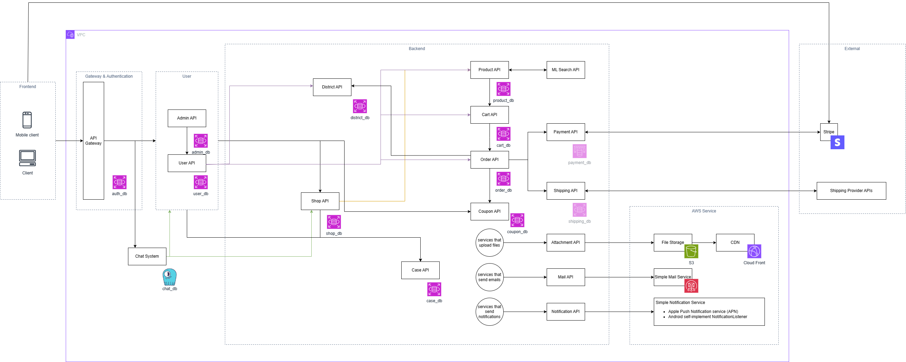

# System Design Diagram
<figure><figcaption>
System Diagram Overview
</figcaption></figure>

## System Diagram Overview
Microservice architecture แยกตามหมวดหมู่การใช้งาน

### Admin API
API สำหรับการจัดการในส่วน Role Admin

### User API
API สำหรับการจัดการที่เกี่ยวข้องกับผู้ใช้

### Distict API
API สำหรับเก็บข้อมูลตำแหน่งต่าง ๆ อย่าง ตำบล, อำเภอ, จังหวัด, รหัสไปรษณีย์

### Shop API
API สำหรับจัดการดูแลในส่วนของ Shop

### Coupon API
API สำหรับจัดการในส่วนของ Coupon เช่น เพิ่ม/ลบ Coupon

### Product API
API สำหรับจัดการในส่วนของ Product ที่มีใน แอปพลิเคชั่น

### Cart API
API สำหรับจัดการตะกร้าสินค้า

### Order API
API สำหรับการสั่งซื้อ

### Payment API
API สำหรับการจ่ายเงิน โดยมีการใช้ External service อื่นด้วย อย่าง Stripe ด้วย

### Shipping API
API สำหรับจัดการการขนส่ง โดยมีการใช้ External service (Shipping Provider APIs) อื่นด้วย

### ML API
API สำหรับเรียกใช้ Machine Learning model เพื่อหาชนิดของข้าว

### Report API
API สำหรับจัดการในส่วนที่เกี่ยวข้องกับการแจ้งละเมิด(Report)

### Attachment API
API สำหรับจัดการข้อมูล/ไฟล์ต่าง ๆ ใช้ service อย่าง Amazon S3 และ Amazon CloudFront

### Mail API
API สำหรับการจัดการ Mail

### Notification API
API สำหรับการจัดการในส่วนที่เกี่ยวข้องกับการแจ้งเตือน
